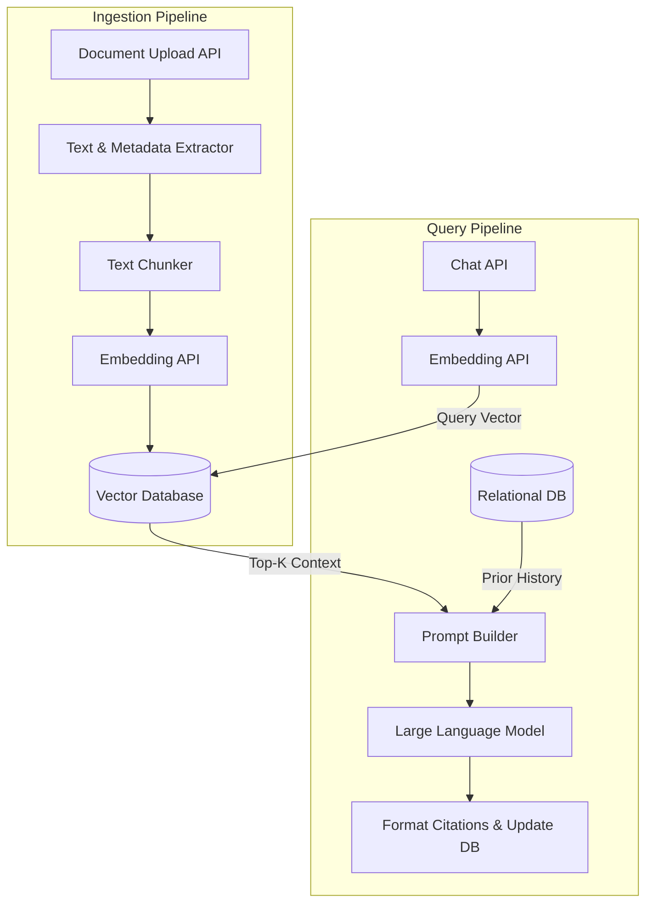
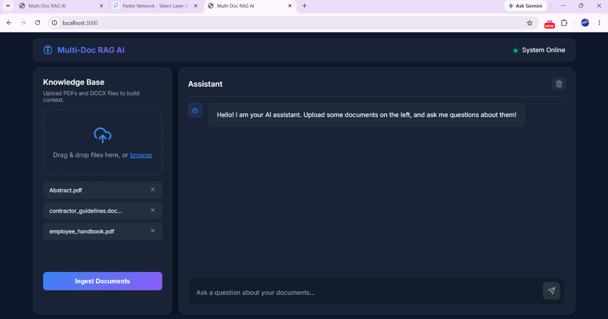
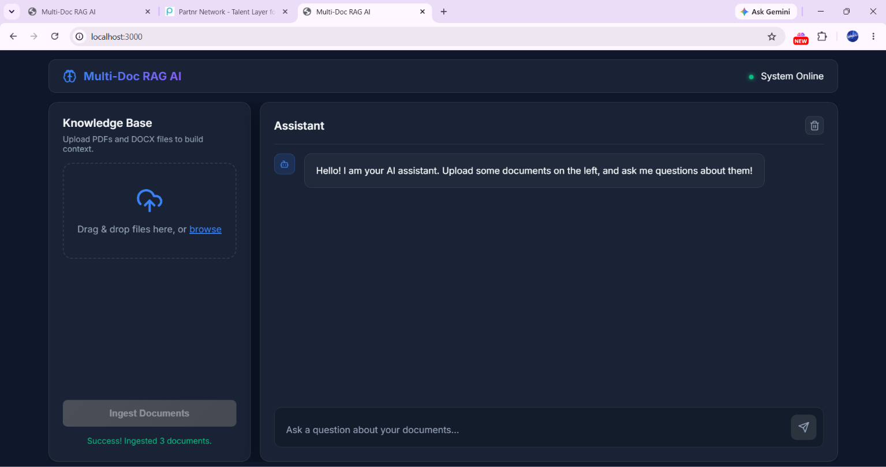
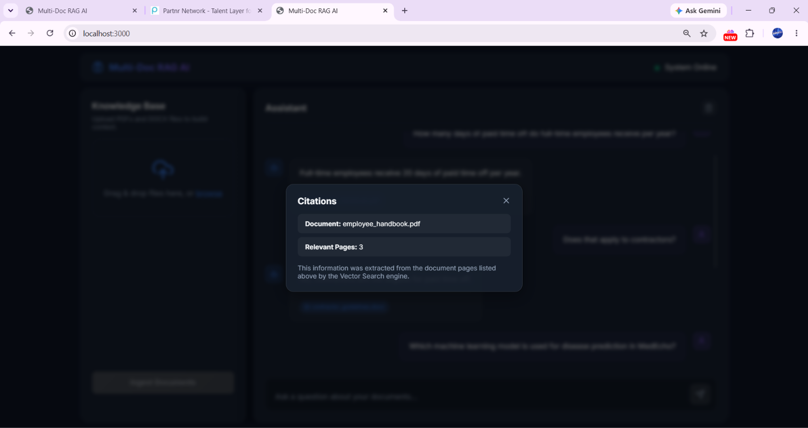
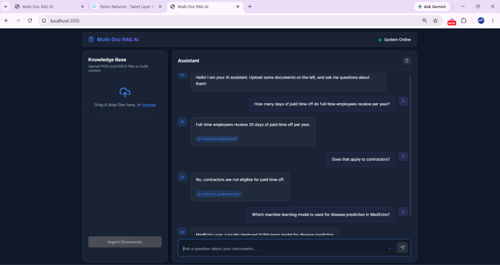
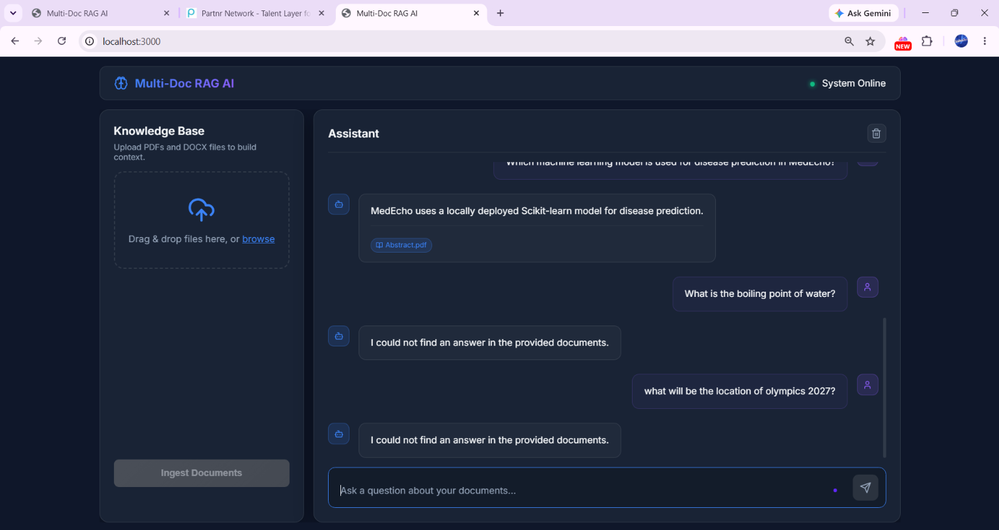

# Multi-Document RAG Question Answering System

An enterprise-grade Retrieval-Augmented Generation (RAG) system built with Node.js. It enables users to upload multiple documents (PDFs, DOCX) and ask context-aware questions with verifiable citations.

## Architectural Overview



This system strictly decouples the data ingestion pipeline from the query pipeline:

1. **Ingestion Pipeline (`POST /api/upload`)**
   - Parses text and extracts metadata (filename, page numbers).
   - Implements a sliding-window chunking strategy to divide documents while preserving semantic context.
   - Generates vector embeddings for each chunk.
   - Upserts vectors and metadata into the Vector Database (Memory or Pinecone).

2. **Query Pipeline (`POST /api/chat`)**
   - Embeds the user's question into a query vector.
   - Performs a semantic cosine-similarity search against the Vector Database.
   - Bypasses generation if results fall below the confidence threshold to prevent hallucinations.
   - Assembles a secure prompt containing context and historical chat turns.
   - Returns the LLM response alongside programmatic citation metadata.

## Prerequisites
- Node.js (v18+)
- (Optional) Pinecone account for cloud vector storage

## Getting Started

### 1. Configuration & External APIs
Create a `.env` file from the example template:
```bash
cp .env.example .env
```

**External API Setup:**
By default, the system runs with local fallback providers, but you can configure external APIs in `.env` for production quality:

- **LLM Provider (Required for high-quality answers):** 
  - Get a free API key from [Groq](https://console.groq.com/) or use [OpenAI](https://platform.openai.com/). 
  - Set `LLM_PROVIDER=groq` (or `openai`) and provide `GROQ_API_KEY`.
- **Vector Database (Optional):**
  - By default, it uses an in-memory store. 
  - For persistence, get a free [Pinecone](https://app.pinecone.io/) API key. Set `VECTOR_DB_TYPE=pinecone` and `PINECONE_API_KEY`.
- **Embedding Provider (Required if using Pinecone):**
  - Pinecone requires dense vectors. If you switch to Pinecone, you MUST set `EMBEDDING_PROVIDER=openai` and provide an `OPENAI_API_KEY`. (If using `memory`, you can leave it as `local`).

### 2. Run Locally (Single Command Setup)
Install dependencies and start the development server:
```bash
npm install && npm run dev
```
The server and web UI will be available at `http://localhost:3000`.

### 3. Run with Docker (Optional)
If you prefer running via Docker, you can use Docker Compose to spin up the application with a single command:
```bash
docker-compose up --build -d
```
This will mount your local `uploads/` directory and SQLite database (`rag_history.db`) to ensure your data persists across container restarts.

## Testing
Run the automated test suite to verify ingestion, extraction, vector operations, and guardrails:
```bash
npm test
```

## API Usage

### Upload Documents
```bash
curl -X POST http://localhost:3000/api/upload \
  -F "files=@path/to/document.pdf"
```

### Ask a Question
```bash
curl -X POST http://localhost:3000/api/chat \
  -H "Content-Type: application/json" \
  -d '{"query": "What is the company PTO policy?", "session_id": "session-123"}'
```

## Demo Screenshots

### 1. Uploading Documents


### 2. Document Ingestion & Processing


### 3. Q&A with Verifiable Citations


### 4. Conversational Follow-up


### 5. Graceful Failure (Hallucination Prevention)

